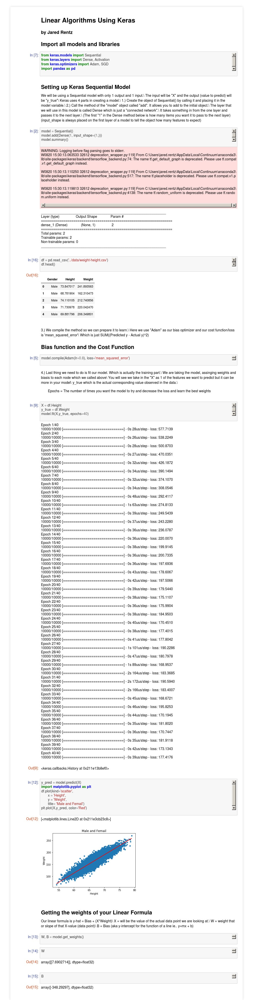

# Understanding_Linear_Algorithms_Keras
Here I walk through a basic Linear Regression Algorithm using Keras. This is to help users new to machine learning how to understand some basic syntax in Keras using Python.

